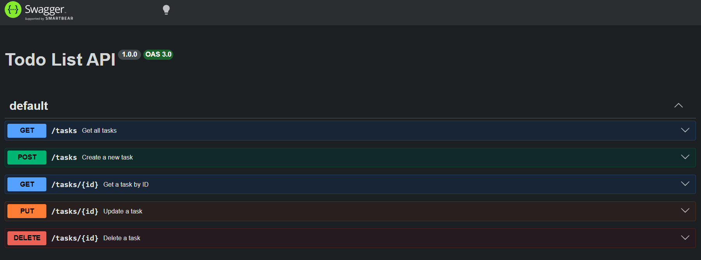
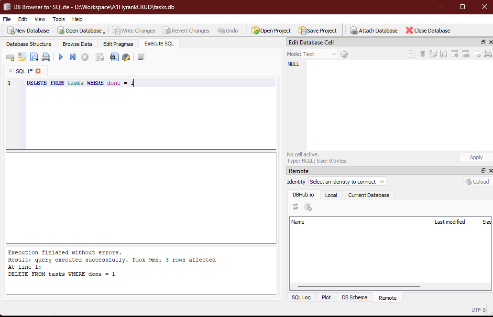

# FlyRank CRUD API

A simple in-memory REST API to manage a to-do list, built with Node.js and Express.

## How to install and run
To run this project locally, clone the repository and run:
```bash
npm install
node index.js
```
The server will start on `http://localhost:3000`.

## Endpoints

| Method | Endpoint | Description |
| :--- | :--- | :--- |
| GET | `/` | Returns API info |
| GET | `/health` | Returns server health status |
| GET | `/tasks` | Lists all tasks |
| GET | `/tasks/:id` | Gets a single task by ID |
| POST | `/tasks` | Creates a new task (requires title) |
| PUT | `/tasks/:id` | Updates a task (title or done status) |
| DELETE | `/tasks/:id` | Deletes a task |

## Example Request
Here is what happens when you create a task via curl:

```bash
curl -i -X POST http://localhost:3000/tasks -H "Content-Type: application/json" -d "{\"title\":\"Delete me later\"}"
HTTP/1.1 201 Created
X-Powered-By: Express
Content-Type: application/json; charset=utf-8
Content-Length: 47
ETag: W/"2f-xkkHcwFB8GFa7XCOp+pQl+oDtwQ"
Date: Fri, 17 Jul 2026 20:43:41 GMT
Connection: keep-alive
Keep-Alive: timeout=5

{"id":4,"title":"Delete me later","done":false}
```

## Swagger UI
You can interact with the API visually by running the server and visiting `http://localhost:3000/docs`.



## Stage 7: AI vs Me

I challenged the AI to build this exact same API to see how it would approach the problem. The AI's code is stored in the `ai-version/` folder.

Here are the key differences I noticed:

1. **Development Tooling:** The AI added `nodemon` and set up `npm run dev` and `start` scripts to automatically restart the server on edits, saving time compared to manually restarting.
2. **File Structure (MVC):** Instead of one giant file, the AI split the code into an MVC (Model-View-Controller) architecture. It separated the data logic (`models`), the request handling (`controllers`), and the URL mapping (`routes`).
3. **Maintainability:** Because of the modular layout, the AI's version would be much easier to maintain, scale, and add features to (like authentication or a real database) in a professional environment.

## Database Storage (Week 3 Update)

This project has been upgraded to use a real database for persistent storage! 

* **Why SQLite?** SQLite was chosen because it is lightweight, requires no external database server to be installed, and stores everything in a single local file. This makes it perfect for a beginner CRUD API.
* **Where is the data?** The data is stored in the `tasks.db` file at the root of the project. (Note: this file is automatically generated the first time you start the server if it doesn't exist).
* **How to start the project:** Simply run `npm install` and then `node index.js`. The database and tables will be created automatically.

### Database Example
Here is a screenshot of the SQLite database being viewed in DB Browser:



Here is an example of the SQL query the API runs behind the scenes when you fetch a specific task:
```sql
SELECT * FROM tasks WHERE id = ?;
```
