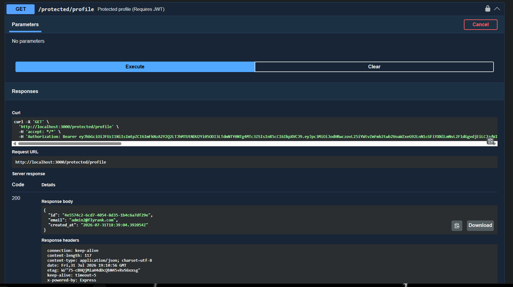

# Week 4: The Ultimate Secured CRUD API

This folder represents the culmination of all four weeks of learning. It merges the **MVC Architecture, PostgreSQL, Docker, and Redis** from Week 3 with the **Supabase JWT Authentication** from Week 4.

## 🎯 Goal
Build a production-ready, fully containerized API where anyone can view data, but only authenticated users possessing a valid JSON Web Token (JWT) can create, update, or delete data.

## 🚀 Architecture & Features
* **Identity Provider:** Outsourced password hashing and cryptography to Supabase.
* **Token Verification:** Custom `requireAuth` Express middleware intercepts write requests, checks the JWT signature, and confirms it isn't expired.
* **Database:** PostgreSQL database using the `pg` library.
* **Cache:** Redis caching layer (prepared for future query caching).
* **Containerization:** The entire Node.js app, Postgres database, and Redis cache run in isolated Docker containers orchestrated by `docker-compose`.
* **Swagger UI:** Configured with a `Bearer Token` security scheme for 1-click authorization testing directly in the browser.

## 💻 How to Run Locally

1. **Environment Variables**
   Create a `.env` file in the root of this folder with your credentials:
   ```text
   SUPABASE_URL=your_supabase_project_url
   SUPABASE_KEY=your_supabase_anon_key
   PORT=3000
   DATABASE_URL=postgres://myuser:secretpassword@db:5432/tasks_db
   REDIS_URL=redis://cache:6379
   ```
2. **Start the Docker Stack**
   ```bash
   docker compose up -d --build
   ```

## 🔒 API Reference

| Endpoint | Method | Auth Required? | Purpose |
| :--- | :--- | :--- | :--- |
| `/auth/signup` | POST | ❌ No | Register a new user account |
| `/auth/login` | POST | ❌ No | Authenticate user & return JWT |
| `/auth/logout` | POST | 🔐 Yes (JWT) | Terminate the user session |
| `/tasks` | GET | ❌ No | View all tasks (Public) |
| `/tasks/:id` | GET | ❌ No | View a specific task (Public) |
| `/tasks` | POST | 🔐 Yes (JWT) | Create a new task |
| `/tasks/:id` | PUT | 🔐 Yes (JWT) | Update a task |
| `/tasks/:id` | DELETE | 🔐 Yes (JWT) | Delete a task |

## 📸 Swagger UI


